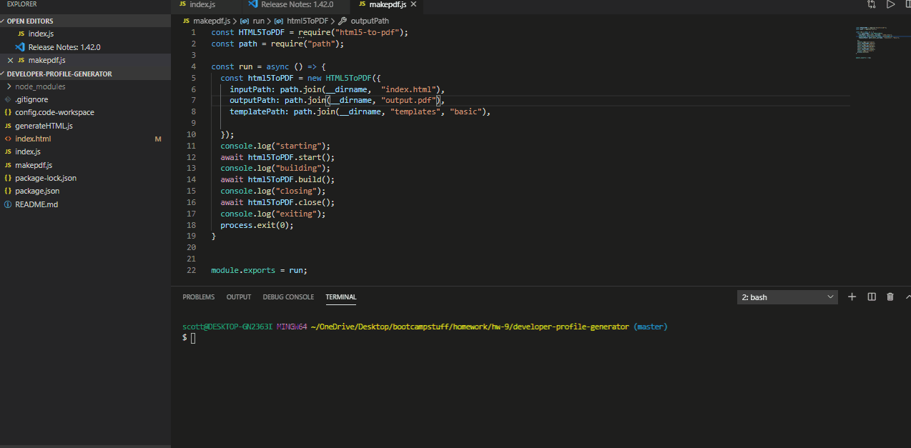

# developer-profile-generator
This node js app creates a developer profile as a pdf when prompted for a users github account. The pdf will be styled to the color scheme requested. 

## Demo results:

 ## License
This project is licensed under the MIT License - see the [LICENSE.md](LICENSE.md) file for details
